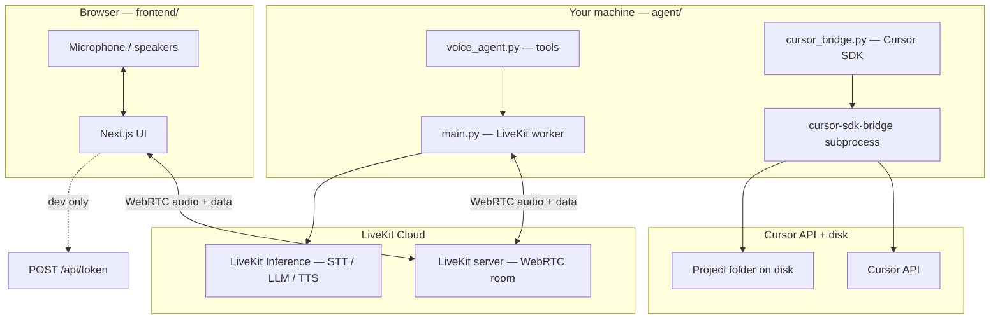
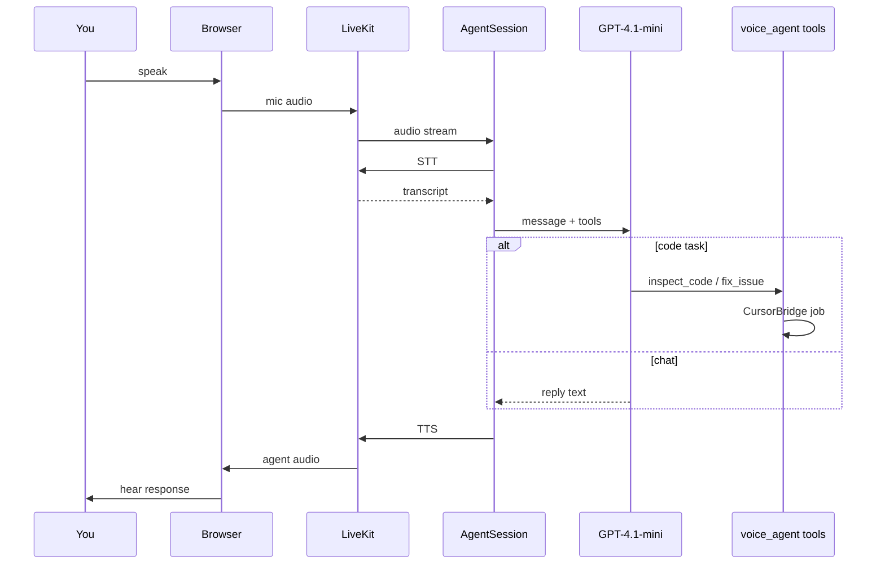

# CODE-AGENT — Voice coding assistant

AI voice agent with a web UI ([LiveKit](https://livekit.io/) + [Agents UI](https://docs.livekit.io/frontends/agents-ui.md)) that reads and edits code via the [Cursor SDK](https://cursor.com/docs/sdk/python).

## Architecture

Three main pieces work together:

| Piece | Technology | Role |
|-------|------------|------|
| **frontend/** | Next.js, LiveKit Components, Agents UI | Browser UI, mic/speakers, folder picker, job log |
| **agent/** | Python, `livekit-agents`, `cursor-sdk` | Joins the voice room, runs STT/LLM/TTS, calls Cursor tools |
| **LiveKit Cloud** | WebRTC + agent dispatch | Real-time audio room; starts the Python worker when you call |
| **Cursor** | `cursor-sdk` + local `cursor-sdk-bridge` | Reads and edits files in your chosen project folder |



## Project structure

```
CODE-AGENT-/
├── .env                         # LiveKit + Cursor secrets (loaded by agent)
├── .env.example
├── frontend/                    # Web app → http://localhost:3000
│   ├── app/
│   │   ├── api/token/           # Mints LiveKit JWT + dispatches agent
│   │   └── api/pick-folder/     # Native folder dialog (Windows, dev)
│   ├── components/app/          # Welcome + session views
│   ├── hooks/
│   │   ├── useSyncWorkspace.ts  # RPC workspace to agent after connect
│   │   ├── useCursorJobLog.ts   # Listens on data topic cursor_job
│   │   └── useEndCallOnSignal.ts# Ends UI session on goodbye
│   ├── lib/workspace.ts         # sessionStorage + token fetch body
│   └── tools/FolderPicker/      # Windows folder picker executable
└── agent/
    └── src/
        ├── main.py              # Worker entry: room, session, goodbye, RPC
        ├── voice_agent.py       # Voice LLM + @function_tool methods
        ├── cursor_bridge.py     # Cursor SDK wrapper + job streaming
        ├── config.py            # Settings from env (keys, model, paths)
        ├── jobs.py              # In-memory job store
        ├── goodbye.py           # Detect bye / end call phrases
        └── env_loader.py        # Load .env from repo root + agent/
```

## End-to-end flow

### A. Startup (before any call)

1. **Agent worker** — `python src/main.py dev` registers `AGENT_NAME` with LiveKit and preloads Silero VAD.
2. **Frontend** — `pnpm dev` serves the UI. No agent logic runs in Node.

### B. Pre-flight and Start call

1. User enters or **Select folder** → path stored in `sessionStorage`.
2. **Start call** → `POST /api/token` with `workspace_path` and `agents: [{ agent_name }]`.
3. Token route returns JWT + `serverUrl` + `roomName` (participant attribute `workspace_path` embedded).
4. Browser connects to LiveKit via **WebRTC** (mic publish, agent audio subscribe).
5. LiveKit **dispatches** the Python worker → `main.py` `entrypoint()` runs for that room.

### C. Agent joins the room

1. `SessionData` + `CursorBridge` created (Cursor not started until a code tool runs).
2. Workspace applied from user JWT attributes, `participant_connected`, or RPC `agent.set_workspace`.
3. `AgentSession` starts with STT/TTS/VAD/turn detection/noise cancellation (see [Models](#models-in-use-livekit-inference--cursor)).
4. `CodeVoiceAgent` attaches as the conversational LLM with tools.
5. `on_enter` speaks a short greeting (waits briefly for workspace if needed).

### D. Each voice turn (while you talk)

1. Mic audio → LiveKit → agent `RoomIO`.
2. **VAD** + **turn detector** decide when you finished speaking.
3. **STT** (Deepgram Nova-3) → transcript → `user_input_transcribed` event.
4. If transcript matches goodbye phrases (`goodbye.py`) → brief TTS → **1.8s** → `session_control` / `end_call` → UI disconnects.
5. **Voice LLM** (GPT-4.1 mini) receives text + tool definitions.
6. LLM replies in speech **or** calls a tool (`inspect_code`, `fix_issue`, etc.).
7. **TTS** (Cartesia) → audio back to browser.



### E. Code tools (`inspect_code` / `fix_issue`)

The voice LLM does **not** edit files directly. It calls tools; tools use **Cursor SDK**:

1. `jobs.py` creates a job id.
2. `cursor_bridge.run_job()`:
   - Publishes `job_update` on LiveKit data topic **`cursor_job`** (UI job log).
   - Verifies Cursor API access (`/v1/me` — catches Free plan).
   - `AsyncClient.launch_bridge(workspace)` — spawns local **`cursor-sdk-bridge`**.
   - `AsyncAgent.create(..., model=CURSOR_MODEL, local=cwd)` — Cursor agent on your disk.
   - `agent.send(prompt)` → streams chunks → final status.
3. Frontend `useCursorJobLog` renders updates.
4. On completion, agent may speak a short summary.

**Fix safety:** `fix_issue` without confirmation only plans; user says yes → `confirm_fix` → writes run.

### F. Ending the call

| Trigger | What happens |
|---------|----------------|
| Say **bye**, **goodbye**, **end call**, etc. | `goodbye.py` → TTS goodbye → 1.8s → `end_call` signal → `session.end()` |
| **`end_call` tool** | Same path (LLM-invoked) |
| **END CALL** button | `useSessionContext().end()` immediately |

## Voice brain vs code hands

Two separate model stacks:

| Job | Model | Configured in |
|-----|--------|----------------|
| Conversation + tool choice | `openai/gpt-4.1-mini` | `voice_agent.py` |
| Speech-to-text | `deepgram/nova-3` | `main.py` |
| Text-to-speech | `cartesia/sonic-3` | `main.py` |
| **Read / edit files** | `CURSOR_MODEL` (default: `default` = Cursor Auto) | `.env` + `cursor_bridge.py` |

Use `default` for Cursor Auto — not `auto` (the API rejects `auto`).

## LiveKit data channels and RPC

| Channel / RPC | Direction | Purpose |
|---------------|-----------|---------|
| Audio tracks | Browser ↔ Agent | Voice |
| `cursor_job` | Agent → Browser | Job status, errors, stream chunks |
| `session_control` | Agent → Browser | `end_call` → disconnect UI |
| RPC `agent.set_workspace` | Browser → Agent | Push project path after connect |

## Secrets (what stays server-side)

| Variable | Used by | Exposed to browser? |
|----------|---------|---------------------|
| `LIVEKIT_API_KEY` / `SECRET` | Token route only | No (only short-lived JWT) |
| `CURSOR_API_KEY` | Python agent only | **Never** |
| `workspace_path` | JWT participant attribute | Path only, not secrets |

## Key dependencies

| Category | Packages / services |
|----------|---------------------|
| Realtime | LiveKit Cloud, `livekit-client`, `livekit-server-sdk`, `livekit-agents` |
| Voice AI | LiveKit Inference (Deepgram, OpenAI, Cartesia) |
| Local audio | Silero VAD, multilingual turn detector, ai-coustics |
| Code automation | `cursor-sdk`, bundled `cursor-sdk-bridge` |
| Web UI | Next.js 15, `@livekit/components-react`, Agents UI |

## Prerequisites

1. [LiveKit Cloud](https://cloud.livekit.io/) project (or self-hosted server)
2. [Cursor API key](https://cursor.com/dashboard/integrations)
3. Python 3.11–3.13 and Node.js 22+ (see `.nvmrc`)
4. [uv](https://docs.astral.sh/uv/) or pip for Python deps

## Setup

### 1. Environment

Copy the example env and fill in credentials (`.env` or `.env.local` both work):

```bash
cp .env.example .env
cp .env frontend/.env
```

The Python agent loads env from **repo root** and **agent/** automatically — you do not need a separate `agent/.env.local` if root `.env` exists.

Required variables:

| Variable | Description |
|----------|-------------|
| `LIVEKIT_URL` | `wss://…livekit.cloud` |
| `LIVEKIT_API_KEY` | LiveKit API key |
| `LIVEKIT_API_SECRET` | LiveKit API secret |
| `AGENT_NAME` | `code-voice-agent` (must match in frontend) |
| `CURSOR_API_KEY` | Cursor user or service account key |
| `CURSOR_MODEL` | Code tools model (`default` = Auto; or e.g. `composer-2.5`) |
| `CURSOR_DEFAULT_CWD` | Optional default project path |
| `CURSOR_ALLOWED_ROOTS` | Optional comma-separated path allowlist |

### 2. Python agent

```bash
cd agent
uv sync
# or: pip install -e .
```

Download model assets (VAD, turn detector):

```bash
uv run python src/main.py download-files
```

### 3. Frontend

```bash
cd frontend
pnpm install
# Optional (best folder picker on Windows — Explorer-style UI):
pnpm build:picker
```

Set in `frontend/.env.local`:

```
LIVEKIT_URL=…
LIVEKIT_API_KEY=…
LIVEKIT_API_SECRET=…
AGENT_NAME=code-voice-agent
```

## Run locally

Terminal 1 — agent worker:

```bash
cd agent
uv run python src/main.py dev
```

Terminal 2 — web UI:

```bash
cd frontend
pnpm dev
```

Open http://localhost:3000, enter your project folder path, start a call, and speak (e.g. “Set workspace to my repo” or “Find the bug in auth.py”).

## Models in use (LiveKit Inference + Cursor)

Configured in [`agent/src/main.py`](agent/src/main.py) and [`agent/src/voice_agent.py`](agent/src/voice_agent.py):

| Layer | Model | Provider |
|-------|--------|----------|
| Speech-to-text | `deepgram/nova-3` (multi) | LiveKit Cloud Inference |
| Voice LLM | `openai/gpt-4.1-mini` | LiveKit Cloud Inference |
| Text-to-speech | `cartesia/sonic-3` | LiveKit Cloud Inference |
| VAD | Silero | Local plugin |
| Turn detection | MultilingualModel | Local (needs PyTorch for full accuracy) |
| Noise reduction | ai-coustics QUAIL_VF_S | Local plugin |
| Code edits (tools) | `default` (Auto, via `CURSOR_MODEL`) | Cursor SDK (`CURSOR_API_KEY`) |

To change the voice LLM, edit `llm=inference.LLM(model="...")` in `voice_agent.py`. To change STT/TTS, edit `AgentSession(...)` in `main.py`.

## Voice tools

| Tool | Purpose |
|------|---------|
| `set_workspace` | Point Cursor at a local repo |
| `inspect_code` | Read-only analysis (background job) |
| `fix_issue` | Code changes (requires verbal confirm) |
| `confirm_fix` | Apply pending fix after user says yes |
| `get_cursor_job_status` | Poll job progress |
| `end_call` | End session after goodbye (also auto-detected from speech) |

Job updates are published on LiveKit data topic `cursor_job` and shown in the UI job log.

## Cursor runtime

- **local** (default): `CURSOR_RUNTIME=local`, uses `LocalAgentOptions(cwd=…)`
- **cloud** (stub): set `CURSOR_RUNTIME=cloud` and `CURSOR_CLOUD_REPO=github.com/org/repo`

## Troubleshooting: “Cursor internal error” / coding task failed

**Most common cause:** Cursor **Free** plan. The SDK shows a vague `internal error HTTP 500`, but the API actually returns `plan_required`. **Pro or Teams** is required for Agents / code tools.

Verify your plan:

```bash
curl -sS -H "Authorization: Bearer YOUR_CURSOR_API_KEY" https://api.cursor.com/v1/me
```

If you see `plan_required`, upgrade at [cursor.com/pricing](https://www.cursor.com/pricing).

Other checks:

1. **`CURSOR_API_KEY`** in repo `.env` from [Cursor integrations](https://cursor.com/dashboard/integrations). Restart `python src/main.py dev` after changing it.
2. **Project folder must exist on disk** — open the path in File Explorer first. OneDrive paths must be synced locally.
3. **Pick the folder before Start call** (full path like `C:\Users\you\project`).
4. Check the **agent terminal** for clearer errors after a failed inspect/fix (the app now pre-checks the API before starting jobs).

## Troubleshooting: “Agent did not enter the room”

1. **Agent worker must be running** before you click Start call:
   ```bash
   cd agent && python src/main.py dev
   ```
2. **Check the agent terminal** for `LIVEKIT_URL is missing` or `ws_url is required`. That means env was not loaded — put `LIVEKIT_URL`, `LIVEKIT_API_KEY`, and `LIVEKIT_API_SECRET` in repo `.env` or `agent/.env`.
3. **`AGENT_NAME` must match** in root/frontend `.env` (`code-voice-agent`) and in the worker log line `registered agent code-voice-agent`.
4. **Same LiveKit project** — frontend and agent must use the same `LIVEKIT_URL` and API key pair.
5. **LiveKit Inference** — this template uses LiveKit Cloud inference for STT/LLM/TTS; ensure your project has inference enabled or swap to plugin keys in `main.py`.

## Security notes

- The bundled `/api/token` route is **dev-only** (no auth). Add authentication before production.
- Restrict workspaces with `CURSOR_ALLOWED_ROOTS`.
- Never expose `CURSOR_API_KEY` to the browser.

## License

LiveKit starter templates are MIT. See starter `LICENSE` files for details.
